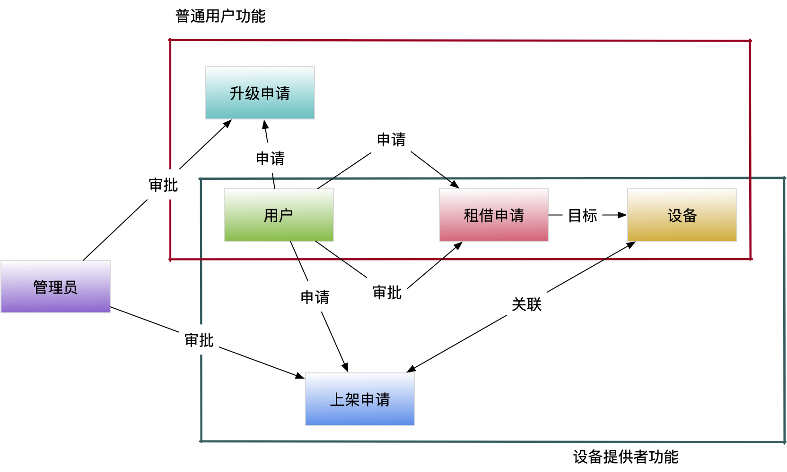

# LabRentPlatform系统设计

## 设计逻辑

### 后端核心功能逻辑

#### 注册与登录

- 未注册用户→填写注册信息→点击发送到邮箱中的地址激活→成为普通用户→登录

#### 租借设备逻辑

- 普通用户→查看设备列表→搜索设备→查看设备信息→填写申请信息→申请租借设备
- 设备提供者→处理租借申请→同意申请→线下租借设备
- 普通用户→线下归还设备
- 设备提供者→确认归还

#### 其他逻辑（普通用户部分）

- 普通用户→申请成为设备提供者→管理员审核→同意申请

#### 其他逻辑（设备提供者部分）

- 设备提供者→填写新设备信息→申请上架设备→管理员审核→同意上架申请→上架设备
- 设备提供者→修改设备信息

#### 其他逻辑（管理员部分）

- 管理员→方便高效地审批上架申请、成为提供者申请
- 管理员→对系统中所有数据信息直接进行增删改查

### 额外功能逻辑

- 消息系统：
	- 用户1→发送消息→用户2→收取消息→回复消息
- 统计与日志：
	- 管理员→查看统计信息、管理员操作日志
	- 管理员→查看用户访问日志（中间件技术）
- 用户登录状态判断（中间件技术）

### 前端框架说明：
本次作业前端采用vue-cli +axios 作为基础，采用Element_Ui进行美化。为了使框架逻辑清晰进行了不同功能的封装。

1.	/src/api
api目录下的index.js封装所有的要向后端发出的api请求。在每个页面(.vue)中，导入api,调用api请求函数，再依据返回结果做处理和显示。

2.	/src/utils
utils目录下的request.js封装所有的axios与后端交互操作。在此创建全局axios对象，并创建了请求拦截和响应拦截。对每一个网络请求，在发送到后端前可以进行预处理，例如在header中增加消息；在响应后进行预处理，例如在返回401,404等不同错误时，根据不同错误执行既定操作。本次作业中，后端预计的错误，部分通过状态200返回错误提示，部分返回状态401，前端页面自动跳转到登录页面。

3.	/src/router
router目录下的index.js封装所有页面之间的关系(A是否是B的组件)，以及页面之间的路由跳转。在此可定义路由守卫，在进入各页面前先判断，如果此页面需要登录而当前未登录，或者此页面是给provider而普通用户通过URL访问，前端页面自动跳转到登录页面。
通过此，在其他页面的点击响应函数中，只要加上this.$router.push('xxx')就可以实现页面跳转。另外还定义了用户在前端使用”/admin”可以跳转到后端的http://127.0.0.1/admin/.

4.	/src/pages
pages目录下封装了所有页面的.vue文件。包括登录页面，个人中心页面，设备列表页面，消息列表页面，通知列表页面，申请列表页面，已租借设备页面等；provider才可以访问的页面放在了/pages/provider目录下。所有页面有良好的英文命名。

## 数据库表设计

### User

描述：用户表

属性：`id`,`username`,`email`,`password`,`is_verified`,`is_provider`

- `is_verified`记录用户注册后是否通过邮箱验证
- `is_provider`记录用户是否为设备提供者

### EmailVerifyCode

描述：邮箱验证码

属性：`id`,`code`,`email`,`send_type`,`add_time`

- `send_type`标记验证码的用途（注册、忘记密码、修改密码）

### Equipment

描述：设备表

属性：`id`,`name`,`description`,`count`

外键：`provider`

- `provider`用于记录设备所有者

### BorrowApply

描述：用于记录用户租借设备的申请信息

属性：`id`,`count`,`end_time`,`reason`,`state`,`unread`

外键：`borrower`,`target_equipment`,`owner`

- `count`为租借的设备数量
- `end_time`为租借的结束时间
- `state`记录租借申请的状态（申请中、已租借、已拒绝、已归还）
- `unread`记录租借者是否已经阅读申请的状态变动通知
- `owner`为租借设备的所有者

### OnShelfApply

描述：用于记录用户上架新设备的申请信息

属性：`id`,`remarks`,`state`,`unread`

外键：`target_equipment`

- `remarks`为上架理由
- `state`记录租借申请的状态（申请中、已租借、已拒绝）

### UpgradeApply

描述：用于记录普通用户成为设备提供者的申请

属性：`id`,`lab_info`,`address`,`phone`,`state`,`unread`

外键：`applicant`

### Message

描述：用于记录用户之间的留言

属性：`id`,`is_read`

外键：`sender`,`receiver`,`content`

### UserLog

描述：用于记录用户日志

属性：`request_type`,`request_query`,`request_body`,`status`

外键：`user`

## 技术方案

- 基于`django.db`封装数据库表结构，使用`Sqlite3`作为数据库
- 使用`Vue.js`搭建前端页面，使用`Element UI`组件库
- 使用`Django`搭建后端API
	- 使用中间件记录用户访问请求与结果、判断登录状态
	- 使用`CORS`技术解决跨域访问问题
	- 使用`TestCase`执行自动化测试，结果如下：
	- 